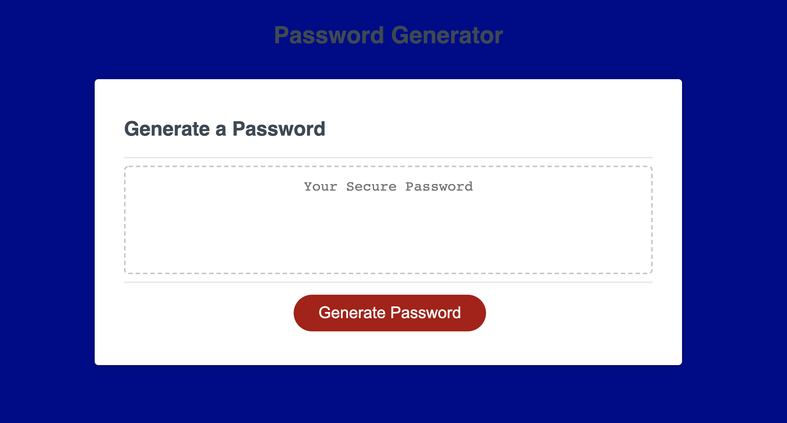

# 03 JavaScript: Password Generator

For this project we were assigned with making an application that generates a random password based on input from the user. The app runs in the browser and features dynamically updated HTML and CSS powered by JavaScript code. 

